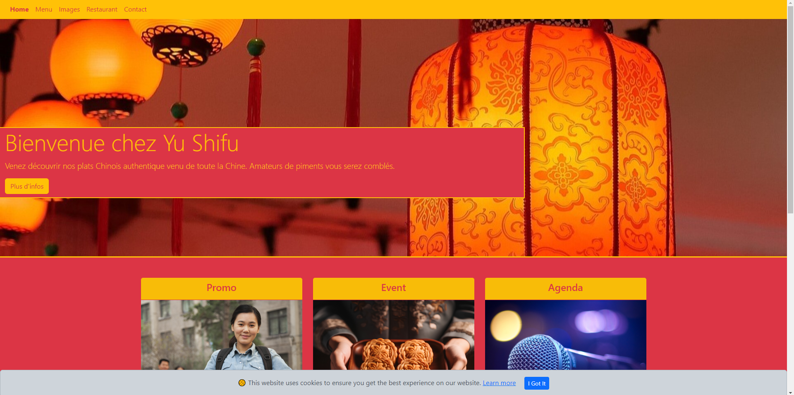

# Yu Shifu

## Creation d'un site pour un restaurant fictif

### Description

Projet de site pour un restaurant chinois fictif en utilisant bootstrap.

[Consignes](https://github.com/becodeorg/Swartz-8/blob/main/1.The-Field/10.Bootstrap/restaurant.adoc)

[Voir site](https://marinevh.github.io/restaurant-css-framework/)

### Contenu

- Le site est responsive
- Inclue minimum 5 pages
- Page d'accueil a un jumbotron et 2 panels
- Page menu a la forme d'une liste avec des badges
- Page images a une gallerie d'image de minimum 10 images avec une pagination (3 photos par page)
- Page restaurant avec son adresse, une carte et des horaires
- Page contact avec un formulaire de contact contenant le prénom, nom de famille, mail, sujet du message (option multiple), un champs de texte pour le message et un bouton envoyé avec un icon

### Technologies utilisées

- HTML
- Bootstrap

### Auteur
Marine Van Hees

Copyright - 10/10/2023